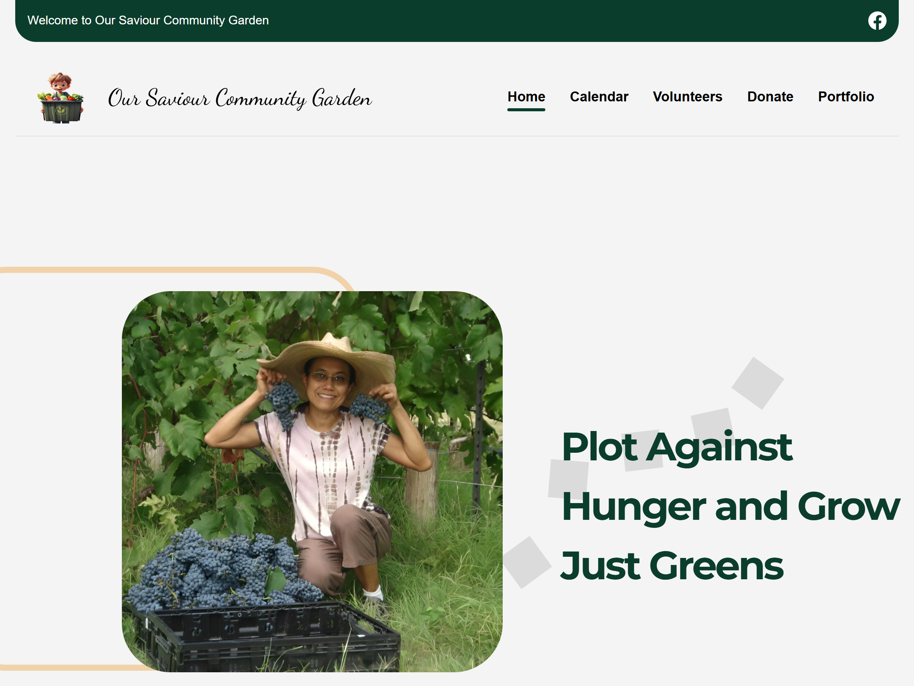

# Our Savior Community Garden



## Project Overview

Our Savior Community Garden (OSCG) is a web application created to manage and organize community garden events. The application features both client and admin frontends, enabling community members to view events and administrators to manage event details. This project was developed as part of an internship under the SMU Engage Dallas program.

## Tech Stack

- **Frontend**: ReactJS
- **Backend**: Flask
- **Database**: MySQL
- **Containerization**: Docker (with Docker Compose)

## Functionality

- The project has two interfaces:
  1. **Client Frontend**: Community members can view upcoming events and details at `http://localhost:3000`.
  2. **Admin Frontend**: Admin users can log in and manage events, which are then reflected on the client frontend. This is accessible at `http://localhost:3001`.

## Getting Started

### Prerequisites

- Git
- Docker (with Docker Compose)

### Installation

1. Open your terminal.
2. Clone the repository:
   ```bash
   git clone https://github.com/BhargavaSharabha/Project-OSCG.git
   ```
3. Navigate into the project directory:
   ```bash
   cd Project-OSCG
   ```
4. Start the application using Docker Compose:
   ```bash
   docker compose up
   ```

### Accessing the Application

- Client Frontend: Open your browser and go to http://localhost:3000.
- Admin Frontend: Admin users can manage events at http://localhost:3001.

## License

This project was developed during an internship for the SMU Engage Dallas program and is intended for the use of the Our Savior Community Garden organization.
